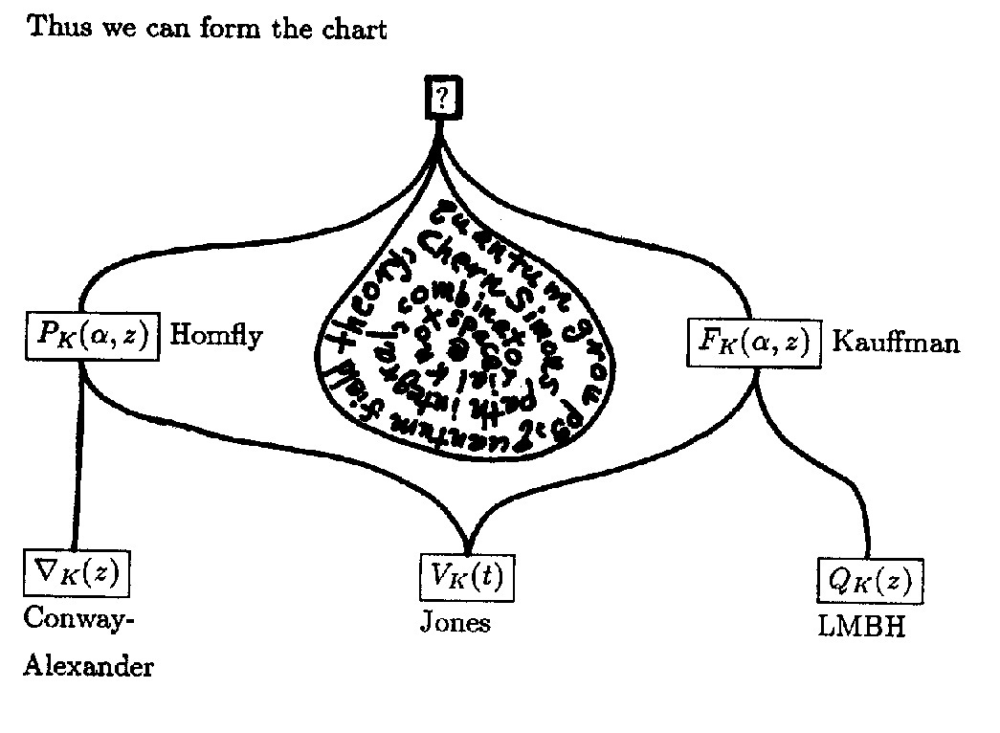
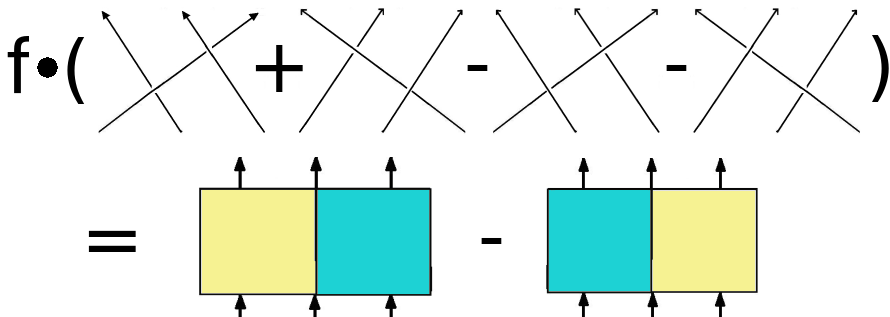
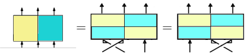
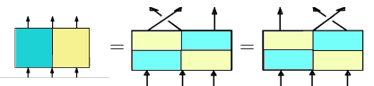
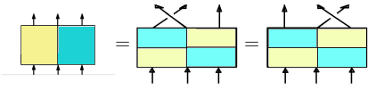
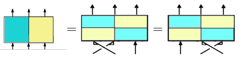
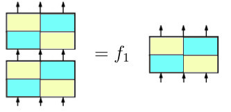
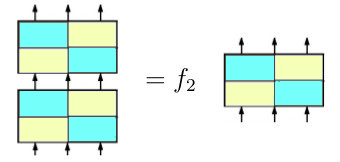
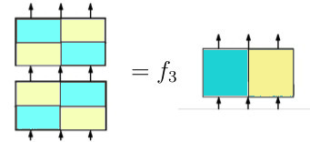
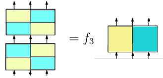

# Using  the SageMath CubicHeckeAlgebra class

## Introduction

$\newcommand{\Q}{{\mathbb Q}\,}$

### Instructions for use

This tutorial comes as a [Jupyter notebook](https://en.wikipedia.org/wiki/Project_Jupyter) (`ipynb`) that may have been exported to a `pdf`, `html` `md`or a `sage` file. The purpose of the `html`, `md` and `pdf` formats is just for reading. But, if you're using it in a [Jupyter client](https://docs.jupyter.org/en/latest/start/index.html) (i.e. the `ipynb`-version) you may experiment with the examples when running the appropriate cells. You're welcome to do that. However, if you are doing this on a pinned [Gitpod](https://gitpod.io/) workspace (for example [this one](https://gitpod.io/start/#sagemath-sage-vvjhs5sv7yz)) please make a copy of the original file for this. 

If you have a [SageMath](https://en.wikipedia.org/wiki/SageMath) distribution with a version of at least 9.7 then you can also run the cells of this tutorial on your own computer. To do this, type `sage -n` in a bash shell located in a directory where you downloaded the `cubic_hecke_algebra_tutorial.ipynb` file. This will open a new tab in your default browser showing the contents of that directory. Clicking on the tutorial file there will open another tab showing the file in a Jupyter client.

You can also copy-paste the contents of the cells into a [Sage command line](https://doc.sagemath.org/html/en/reference/repl/index.html) session if the Sage version is at least 9.7. Note, however, that some of the examples require optional packages (as explained in the tutorial). If you just want to use the tutorial examples for your own experiments then you can import its variables by loading the `sage` file, that is

```
sage: load('https://github.com/soehms/database_cubic_hecke/tutorials/cubic_hecke_tutorial.sage')
```

If you don't want to install Sage on your machine but have [Docker](https://en.wikipedia.org/wiki/Docker_(software)) on it, you can also run the examples in a Sage command line by using `docker run -it soehms/sagemath_knots:latest` and load the `cubic_hecke_tutorial.sage` file as described above. The command line version can also be used in the terminal of the [Gitpod workspace](https://gitpod.io/start/#sagemath-sage-vvjhs5sv7yz).

### About

This tutorial is about a [class](https://doc.sagemath.org/html/en/reference/algebras/sage/algebras/hecke_algebras/cubic_hecke_algebra.html) from the [SageMath](http://www.sagemath.org/) library which is available since [release 9.7](https://wiki.sagemath.org/ReleaseTours/sage-9.7). It allows to do calculations in [cubic Hecke algebras](https://arxiv.org/abs/1110.6621), which are certain [epimorphic images](https://en.wikipedia.org/wiki/Epimorphism) of [group algebras](https://en.wikipedia.org/wiki/Group_ring) of [Artin braid groups](https://en.wikipedia.org/wiki/Braid_group).

More explicitly, we consider the factors such that the images $s_i$ of the braid generators satisfy a cubic equation:

$$ s_i^3 = u s_i^2 - v s_i + w $$

Here $u, v, w$ are elements in an arbitrary [integral domain](https://en.wikipedia.org/wiki/Integral_domain). By the analogue to the [Iwahori Hecke algebras](https://doc.sagemath.org/html/en/reference/algebras/sage/algebras/iwahori_hecke_algebra.html), in which the braid generators satisfy a quadratic relation these algebras have been called *cubic Hecke algebras*.

The relations inherited from the braid group are:

$$s_i s_{i+1} s_i = s_{i+1} s_i s_{i+1} \text{ for } 1 \leq i < n - 1
    \mbox{ and } s_i s_j = s_j s_i \text{ for } 1 \leq i < j - 1 < n - 1.$$


The algebra epimorphism from the [braid group algebra](https://doc.sagemath.org/html/en/reference/algebras/sage/algebras/hecke_algebras/cubic_hecke_algebra.html#sage.algebras.hecke_algebras.cubic_hecke_algebra.CubicHeckeAlgebra.braid_group_algebra) over the same base ring is realized inside the [element constructor](https://doc.sagemath.org/html/en/reference/structure/sage/structure/parent.html?highlight=element%20constructor#sage.structure.parent.Parent.__call__) of the present class which is executed when in instance of the class is applied to appropriate data. For example in the case of the 3 strand cubic Hecke algebra we obtain the braid group by the method [braid_group](https://doc.sagemath.org/html/en/reference/algebras/sage/algebras/hecke_algebras/cubic_hecke_algebra.html#sage.algebras.hecke_algebras.cubic_hecke_algebra.CubicHeckeAlgebra.braid_group) and define a braid with its help:


```python
CHA3 = algebras.CubicHecke(3)
BG3 = CHA3.braid_group()
braid = BG3((1,2,-1,2,2,-1)); braid
```


    c0*c1*c0^-1*c1^2*c0^-1


Its image in the cubic Hecke algebra is: 


```python
CHA3(braid)
```


    u*c1*c0^-1*c1 + u*v*c0*c1^-1*c0^-1 + (-u^2)*c0^-1*c1 + ((u^2*v-v^2)/w)*c0*c1*c0^-1 + ((u^2-v)/w)*c0*c1*c0 + ((-u^3+u*v)/w)*c0*c1 + (-u*v+w)*c1^-1


If the ring elements $u, v, w$ (which will be called the [cubic equation parameters](https://doc.sagemath.org/html/en/reference/algebras/sage/algebras/hecke_algebras/cubic_hecke_algebra.html#sage.algebras.hecke_algebras.cubic_hecke_algebra.CubicHeckeAlgebra.cubic_equation_parameters) in the sequel) are taken to be $u = v = 0, w = 1$ the cubic Hecke algebra specializes to the group algebra of the [cubic braid group](https://doc.sagemath.org/html/en/reference/groups/sage/groups/cubic_braid.html?highlight=cubic%20braid%20group#cubic-braid-groups), which is the factor group of the Artin braid
group under setting the generators order to be three. A class to work with these groups
is attached to this class and can be obtained by the [cubic_braid_group](https://doc.sagemath.org/html/en/reference/algebras/sage/algebras/hecke_algebras/cubic_hecke_algebra.html#sage.algebras.hecke_algebras.cubic_hecke_algebra.CubicHeckeAlgebra.cubic_braid_group)-method. 


It is well known, that these algebras are free of finite rank as long as the number of braid generators is less than six and infinite dimensional else-wise. In the former (non trivial) cases they are also known as [cyclotomic Hecke algebras](https://www.researchgate.net/publication/1768251_On_the_cyclotomic_Hecke_algebras_of_complex_reflection_groups) corresponding to the [complex reflection groups](https://doc.sagemath.org/html/en/reference/categories/sage/categories/complex_reflection_groups.html?highlight=complex%20reflection%20groups#complex-reflection-groups)
having Shepard-Todd number $4, 25$ and $32$ (see the table at [Wikipedia](https://en.wikipedia.org/wiki/Complex_reflection_group)).

Since the [Broué, Malle and Rouquiere](https://arxiv.org/abs/1606.08456) conjecture has been proved in all these cases (for references see [Mar2012](https://arxiv.org/abs/1110.6621) below) there exists a finite free basis of the cubic Hecke algebra which is in bijection to the cubic braid group and compatible with the specialization to the cubic braid group algebra as explained above.

For the algebras corresponding to braid groups of less than five strands such a basis has been calculated by Ivan Marin. This one is used here via a [Python wrapper](https://github.com/soehms/database_cubic_hecke#readme). In the case of 5 strands such a basis is not available, right now. Instead the elements of the cubic braid group class themselves are used as basis elements. This is also the case when the cubic braid group is infinite, even though it is not known if these elements span all of the cubic Hecke algebra.

Accordingly, be aware that the realization of the coercion map from the group algebra of the cubic braid groups is known to be an isomorphism of free modules only in the cases of less than five strands. 


REFERENCES:

- [CM2012](https://arxiv.org/abs/1010.1465) M. Cabanes, I. Marin, On ternary quotients of cubic Hecke algebras, Comm. Math. Phys. August 2012, Volume 314, Issue 1, pp 57-92, [doi](https://doi.org/10.1007/s00220-012-1519-7).
- [Mar2012]( https://arxiv.org/abs/1110.6621) Ivan Marin: The cubic Hecke algebra on at most 5 strands. Journal of Pure and Applied Algebra 216 (2012) 2754-2782, [doi](https://doi.org/10.1016/j.jpaa.2012.04.013).
- [Mar2018](http://www.lamfa.u-picardie.fr/marin/arts/GQ.pdf) Ivan Marin: Preprint A  MAXIMAL  CUBIC  QUOTIENT  OF  THE  BRAID  ALGEBRA.

## First steps

In the global namespace of Sage the cubic Hecke algebra is present as `algebras.CubicHecke`. Online help can be requested with a question mark right behind the last character: `algebras.CubicHecke?`. This also works for all instances of classes and methods that you may define in the sequel, for examples `CHA3?` after running the next cell gives the same information, but `CHA3.cubic_hecke_subalgebra?` displays the online-help for that specific method.

To define the cubic Hecke algebra on 3 strands,type:


```python
CHA3 = algebras.CubicHecke(3); CHA3
```


    Cubic Hecke algebra on 3 strands over Multivariate Polynomial Ring in u, v, w over Integer Ring localized at (w,) with cubic equation: h^3 - u*h^2 + v*h - w = 0


```python
CHA3.inject_variables(); c0*c1
```

    Defining c0, c1


    c0*c1


If you like to use your own names it is possible to include a generator declaration inside the algebra declaration:


```python
CHA3abc.<c1, c2> = algebras.CubicHecke(3, cubic_equation_parameters='a, b, c', cubic_equation_roots='x, y, z'); CHA3abc
```


    Cubic Hecke algebra on 3 strands over Multivariate Polynomial Ring in a, b, c over Integer Ring localized at (c,) with cubic equation: h^3 - a*h^2 + b*h - c = 0


The underlying cubic equation of the algebra can be obtained by:


```python
CHA3.cubic_equation()
```


    h^3 - u*h^2 + v*h - w


```python
CHA3abc.cubic_equation()
```


    h^3 - a*h^2 + b*h - c


So far, the only difference between these both definitions of a cubic Hecke algebra consists in the names of the parameters. The argument `cubic_equation_parameters` can also be used to define the algebra over a specialized ring:


```python
BRQ.<p,q,r> = FractionField(ZZ['p,q,r'])
CHA3pqr = algebras.CubicHecke(3, cubic_equation_parameters=(p, q, r)); CHA3pqr
```


    Cubic Hecke algebra on 3 strands over Fraction Field of Multivariate Polynomial Ring in p, q, r over Integer Ring with cubic equation: h^3 - p*h^2 + q*h - r = 0


The roots are constructed in a maximal extension ring if they don't belong to the domain of the `cubic_equation_parameters`:


```python
roots = CHA3pqr.cubic_equation_roots(); print(roots)
roots[0].parent()
```

    [a, b, -b - a + p]


    Splitting Algebra of T^2 + T + 1 with roots [E3, -E3 - 1] over Splitting Algebra of h^3 - p*h^2 + q*h - r with roots [a, b, -b - a + p] over Fraction Field of Multivariate Polynomial Ring in p, q, r over Integer Ring


```python
Z3 = CyclotomicField(3)
e = Z3.gen()
CHA3z3 = algebras.CubicHecke(3, cubic_equation_parameters=(e, e**2, 1)); CHA3z3
```


    Cubic Hecke algebra on 3 strands over Cyclotomic Field of order 3 and degree 2 with cubic equation: h^3 - zeta3*h^2 + (-zeta3 - 1)*h - 1 = 0


```python
roots = CHA3z3.cubic_equation_roots(); print(roots)
roots[0].parent()
```

    [S^2 - 1, S, -S]


    Number Field in S with defining polynomial h^4 - h^2 + 1


```python
CHA3int = algebras.CubicHecke(3, cubic_equation_parameters=(5, 7, 11)); CHA3int
```


    Cubic Hecke algebra on 3 strands over Integer Ring localized at (11,) with cubic equation: h^3 - 5*h^2 + 7*h - 11 = 0


```python
roots = CHA3int.cubic_equation_roots(); print(roots)
roots[0].parent()
```

    [a, b, -b - a + 5]


    Splitting Algebra of T^2 + T + 1 with roots [E3, -E3 - 1] over Splitting Algebra of h^3 - 5*h^2 + 7*h - 11 with roots [a, b, -b - a + 5] over Integer Ring localized at (11,)


You can define the roots of the cubic equation, as well:


```python
GF25 = GF(25,'t')
g2 = GF25(1)
g3 = GF25.gen()
g4 = GF25(3)
CHA3gf25 = algebras.CubicHecke(3, cubic_equation_roots=(g2, g3, g4)); CHA3gf25
```


    Cubic Hecke algebra on 3 strands over Finite Field in t of size 5^2 with cubic equation: h^3 + (4*t + 1)*h^2 + (4*t + 3)*h + 2*t = 0


Examples of Elements:


```python
print('Element of CHA3 %s' %(CHA3.an_element()))
print('Element of CHA3abc %s' %(CHA3abc.an_element()))
print('Element of CHA3pqr %s' %(CHA3pqr.an_element()))
print('Element of CHA3z3 %s' %(CHA3z3.an_element()))
print('Element of CHA3int %s' %(CHA3int.an_element()))
print('Element of CHA3gf25 %s' %(CHA3gf25.an_element()))
```

    Element of CHA3 (-w)*c0*c1^-1 + v*c0 + u*c1 + ((-v*w+u)/w)
    Element of CHA3abc (-c)*c1*c2^-1 + b*c1 + a*c2 + ((-b*c+a)/c)
    Element of CHA3pqr (-r)*c0*c1^-1 + q*c0 + p*c1 + ((-q*r+p)/r)
    Element of CHA3z3 -c0*c1^-1 - (zeta3+1)*c0 - (-zeta3)*c1 + (2*zeta3+1)
    Element of CHA3int -11*c0*c1^-1 + 7*c0 + 5*c1 - 72/11
    Element of CHA3gf25 2*t*c0*c1^-1 + (4*t+3)*c0 + (t+4)*c1 + (2*t+3)


Multiplication is possible without any restriction in the cubic Hecke algebra up to four strands:


```python
ele3 = CHA3.an_element()
ele3*c0
```


    (-w)*c0*c1^-1*c0 + u*c1*c0 + v*w*c0^-1 + ((u*v*w-v*w+u)/w)*c0 + (-v^2)


## Matrix representations

To each element you can obtain matrix representations of different types. By default this is a block-matrix, whose blocks are the  split irreducible representation which are available at [Ivan Marin's hompage](http://www.lamfa.u-picardie.fr/marin/softs/H4/RepresentationsH25):


```python
CHA2 = CHA3.cubic_hecke_subalgebra()
ele2 = CHA2.an_element(); print(ele2)
m = ele2.matrix(); m
```

    v*c0 + ((-v*w+u)/w)


    [              v*a + (-v*w + u)/w                                0                                0]
    [                               0               v*b + (-v*w + u)/w                                0]
    [                               0                                0 -v*b - v*a + (u*v*w - v*w + u)/w]


Here the entries are taken from an extension of the base ring (indeterminates u, v, w) splitting the cubic equation with roots a, b, c. This ring is called the extension ring of `CHA3`:


```python
m.base_ring() == CHA2.extension_ring()
```


    True


The original version with entries being Laurent polynomials in $a, b, c$ can be obtained using the keyword option `original` or by changing the base ring to the *generic* extension ring:


```python
mo = ele2.matrix(original=True)
mo == m.change_ring(CHA2.extension_ring(generic=True))
```


    True


A single irreducible representation can be obtained by array index which can be an integer:


```python
m[1]
```


    [v*b + (-v*w + u)/w]


```python
mo[1]
```


    [a*b^2 + a*b*c + b^2*c - a*b - a*c - b*c + b^-1*c^-1 + a^-1*c^-1 + a^-1*b^-1]


or an enum naming the representation:


```python
mo[CHA2.irred_repr.W2_100]
```


    [a^2*b + a^2*c + a*b*c - a*b - a*c - b*c + b^-1*c^-1 + a^-1*c^-1 + a^-1*b^-1]


Other representation types are the left and right regular representations, which are taken from Ivan Marin's home page, as well:


```python
ml = ele2.matrix(representation_type=CHA2.repr_type.RegularLeft); ml
```


    [       (-v*w + u)/w                -v^2                   v]
    [                  v (u*v*w - v*w + u)/w                   0]
    [                  0                 v*w        (-v*w + u)/w]


and (in case [GAP3](https://webusers.imj-prg.fr/~jean.michel/gap3/) is installed together with its package `CHEVIE`) the split irreducibles available from there. In case of the two strand algebra they coincide with Marin's version: 


```python
mg = ele2.matrix(representation_type=CHA2.repr_type.SplitIrredChevie)
m == m.parent()(mg)
```


    True


but not in general:


```python
CHA3 = algebras.CubicHecke(3)
c1, c2 = CHA3.gens()
m1 = c1.matrix()
m1g = c1.matrix(representation_type=CHA3.repr_type.SplitIrredChevie)
m1.dict() == m1g.dict()
```


    False


Furthermore, you may obtain irreducible matrix representations for cubic Hecke algebras on 5 strands by using `SplitIrredChevie` which is not possible for the other types (see the examples in the last section).

## Markov traces

A Markov trace is a family of class functions $tr_n$ on the family of braid groups $B_n$ into some commutative ring $R$ depending on a unit $s \in R$ such that for all $b \in B_n$ the following two conditions are satisfied (see [Louis Kauffman: Knots and Physics](https://doc.sagemath.org/html/en/reference/references/index.html#kau1991), section 7):


$$\begin{array}{lll}
    tr_{n+1}(b g_n)      &  = &  s\, tr_n(b), \\
    tr_{n+1}(b g^{-1}_n) &  = &  s^{-1} tr_n(b).
    \end{array}
$$

The unit $s$ is often called the writhe factor and corresponds to the additional variable mentioned above. Each Markov trace can be transformed into a polynomial Link invariant. Most of the Markov traces come from the well known Link invariants that factor through the cubic Hecke algebra. This covers Markov traces corresponding to the

- [HOMFLY-PT polynomial](https://doc.sagemath.org/html/en/reference/knots/sage/knots/link.html?highlight=homfly#sage.knots.link.Link.homfly_polynomial)
- [Kauffman polynomial](https://doc.sagemath.org/html/en/reference/knots/sage/knots/knotinfo.html#sage.knots.knotinfo.KnotInfoBase.kauffman_polynomial)
- [Links-Gould polynomial](https://doc.sagemath.org/html/en/reference/knots/sage/knots/link.html#sage.knots.link.Link.links_gould_polynomial)

In addition this is also true for:

- [Alexander polynomial](https://doc.sagemath.org/html/en/reference/knots/sage/knots/link.html#sage.knots.link.Link.alexander_polynomial)
- [Conway polynomial](https://doc.sagemath.org/html/en/reference/knots/sage/knots/link.html#sage.knots.link.Link.conway_polynomial)
- [Jones polynomial](https://doc.sagemath.org/html/en/reference/knots/sage/knots/link.html#sage.knots.link.Link.jones_polynomial)


since these can be obtained from the HOMFLY-PT polynomial. Furthermore, the [Brandt-Lickorish-Millett-Ho polynomial(LMBH)](https://encyclopediaofmath.org/wiki/Brandt-Lickorish-Millett-Ho_polynomial) is such an invariant, too, as a specialization of the Kauffman polynomial. These connections are displayed in the following chart which can be found in [Louis Kauffman: Knots and Physics](https://doc.sagemath.org/html/en/reference/references/index.html#kau1991) on page 54:

<p></p>

If there exists something replacing the question mark in this picture there is a good chance that the corresponding Markov trace factors through the cubic Hecke algebra, as well.

It's just a matter of linear algebra calculations to find all such traces on the cubic Hecke algebra on four strands which might have an extension to a Markov trace. The result of these calculations can be obtained using the method [formal_markov_trace](https://doc.sagemath.org/html/en/reference/algebras/sage/algebras/hecke_algebras/cubic_hecke_algebra.html#sage.algebras.hecke_algebras.cubic_hecke_algebra.CubicHeckeElement.formal_markov_trace).

This method returns elements of a sub-module of the module of linear forms on the cubic Hecke algebra the base ring of which is an extension of the generic base ring of it by an additional variable $s$ representing the writhe factor. All variables of this base ring extension are invertible.

### Note

> Currently it is not known if all linear forms of this sub-module belong to a Markov trace, i.e. can be extended to the full tower of cubic Hecke algebras. Anyway, at least the four basis elements ($U1$, $U2$, $U3$ and $K4$) can be reconstructed form the HOMFLY-PT and Kauffman polynomial.

### Examples


```python
from sage.knots.knotinfo import KnotInfo
L5a1_0 = KnotInfo.L5a1_0
L5a1_0b = L5a1_0.braid()
L5a1_0c = CHA3(L5a1_0b)
L5a1_0m = L5a1_0c.formal_markov_trace(); L5a1_0m
```


    ((-u^2*s^2+s^4-u*w)/(w*s^2))*B[U1] + u*v/(w*s)*B[U2] + v/w*B[K4]


This expression is an element of a module of rank 4 over the generic base ring of `CHA3` adjoined with the element `s`:


```python
M = L5a1_0m.parent(); M
```


    Free module generated by {U1, U2, U3, K4} over Multivariate Polynomial Ring in u, v, w, s over Integer Ring localized at (s, w, v, u)


The basis is indexed by elements of an [enum class](https://docs.python.org/3/library/enum.html) which represent certain links:


```python
basis_index = M.basis().keys()
[(i.name, i.description(), i.regular_homfly_polynomial()) for i in basis_index]
```


    [('U1', 'one unlink', 1),
     ('U2', 'two unlinks', -L*M^-1 - L^-1*M^-1),
     ('U3', 'three unlinks', L^2*M^-2 + 2*M^-2 + L^-2*M^-2),
     ('K4', 'knot 4_1', -L^2 + M^2 - 1 - L^-2)]


For example the trace function corresponding to the basis element indexed by `K4` is a linear form vanishing on all braids on three strands whose closure is a union of between one and three unlinks but evaluate to `1` on braids whose closure is the figure eight knot. 

For all these basis indices you may obtain the corresponding two variate polynomial invariant:


```python
K4 = basis_index[3]
print([meth for meth in dir(K4) if meth.endswith('polynomial')])
K4.links_gould_polynomial()
```

    ['links_gould_polynomial', 'regular_homfly_polynomial', 'regular_kauffman_polynomial']


    2*t0*t1 - 3*t0 - 3*t1 + t0*t1^-1 + 7 + t0^-1*t1 - 3*t1^-1 - 3*t0^-1 + 2*t0^-1*t1^-1


Let's verify the specialization for `L5a1_0`. First we need to perform a transition from invariance with respect to [regular isotopy](https://en.wikipedia.org/wiki/Regular_isotopy) to [ambient isotopy](https://en.wikipedia.org/wiki/Ambient_isotopy). This is done by multiplying by $s^{-\omega}$ where $\omega$ is the writhe of the link. In our case $\omega = -1$:


```python
MB = L5a1_0m.base_ring(); print(MB)
s = MB.gen(3)
L5 = L5a1_0m*s; print(L5)
sup = L5.support(); sup
```

    Multivariate Polynomial Ring in u, v, w, s over Integer Ring localized at (s, w, v, u)
    ((-u^2*s^2+s^4-u*w)/(w*s))*B[U1] + u*v/w*B[U2] + v*s/w*B[K4]


    SupportView({U2: u*v/w, U1: (-u^2*s^2 + s^4 - u*w)/(w*s), K4: v*s/w})


Next we need epimorphisms from the base ring of our module to the rings of the well known invariants:


```python
specH = MB.specialize_homfly(); print('H:', specH)
specK = MB.specialize_kauffman(); print('K:', specK)
specL = MB.specialize_links_gould(); print('L:', specL)
```

    H: Composite map:
      From: Multivariate Polynomial Ring in u, v, w, s over Integer Ring localized at (s, w, v, u)
      To:   Multivariate Laurent Polynomial Ring in L, M over Integer Ring
      Defn:   Ring morphism:
              From: Multivariate Polynomial Ring in u, v, w, s over Integer Ring localized at (s, w, v, u)
              To:   Multivariate Polynomial Ring in L, M over Integer Ring localized at (M, M - 1, L)
              Defn: u |--> -M + 1
                    v |--> -M + 1
                    w |--> 1
                    s |--> L
            then
              Conversion map:
              From: Multivariate Polynomial Ring in L, M over Integer Ring localized at (M, M - 1, L)
              To:   Multivariate Laurent Polynomial Ring in L, M over Integer Ring
    K: Composite map:
      From: Multivariate Polynomial Ring in u, v, w, s over Integer Ring localized at (s, w, v, u)
      To:   Multivariate Laurent Polynomial Ring in a, z over Integer Ring
      Defn:   Ring morphism:
              From: Multivariate Polynomial Ring in u, v, w, s over Integer Ring localized at (s, w, v, u)
              To:   Multivariate Polynomial Ring in a, z over Integer Ring localized at (z, a, a + z, a*z + 1)
              Defn: u |--> (a*z + 1)/a
                    v |--> (a + z)/a
                    w |--> 1/a
                    s |--> a
            then
              Conversion map:
              From: Multivariate Polynomial Ring in a, z over Integer Ring localized at (z, a, a + z, a*z + 1)
              To:   Multivariate Laurent Polynomial Ring in a, z over Integer Ring
    L: Composite map:
      From: Multivariate Polynomial Ring in u, v, w, s over Integer Ring localized at (s, w, v, u)
      To:   Multivariate Laurent Polynomial Ring in t0, t1 over Integer Ring
      Defn:   Ring morphism:
              From: Multivariate Polynomial Ring in u, v, w, s over Integer Ring localized at (s, w, v, u)
              To:   Multivariate Polynomial Ring in t0, t1 over Integer Ring localized at (t1, t0, t0 + t1 - 1, t0*t1 - t0 - t1)
              Defn: u |--> t0 + t1 - 1
                    v |--> t0*t1 - t0 - t1
                    w |--> -t0*t1
                    s |--> 1
            then
              Conversion map:
              From: Multivariate Polynomial Ring in t0, t1 over Integer Ring localized at (t1, t0, t0 + t1 - 1, t0*t1 - t0 - t1)
              To:   Multivariate Laurent Polynomial Ring in t0, t1 over Integer Ring


Now, we can do the comparison:


```python
pH = sum(specH(L5.coefficient(b)) * b.regular_homfly_polynomial() for b in sup); print('H:', pH)
pK = sum(specK(L5.coefficient(b)) * b.regular_kauffman_polynomial() for b in sup); print('K:', pK)
pL = sum(specL(L5.coefficient(b)) * b.links_gould_polynomial() for b in sup); print('L:', pL)

l5a1_0 = L5a1_0.link()
print('H:', pH == l5a1_0.homfly_polynomial())
print('K:', pK == L5a1_0.kauffman_polynomial()) # taken from KnotInfo since not available in Sage, yet
print('L:', pL == l5a1_0.links_gould_polynomial())
```

    H: L^3*M - L*M^3 + 2*L*M - L*M^-1 + L^-1*M - L^-1*M^-1
    K: a^4*z^2 + 2*a^3*z^3 + a^2*z^4 - 2*a^3*z + 3*a*z^3 + z^4 - 4*a*z - z^2 + a^-1*z^3 + a*z^-1 - 1 - 2*a^-1*z + a^-1*z^-1
    L: -2*t0*t1 + 4*t0 + 4*t1 - 3*t0*t1^-1 - 10 - 3*t0^-1*t1 + t0*t1^-2 + 9*t1^-1 + 9*t0^-1 + t0^-2*t1 - 3*t1^-2 - 8*t0^-1*t1^-1 - 3*t0^-2 + 2*t0^-1*t1^-2 + 2*t0^-2*t1^-1
    H: True
    K: True
    L: True


## An Application: Defining minimal quasi-idempotents 

Let's apply the `CubicHeckeAlgebra` to some investigation concerning the obstruction `b` of the *triple quadratic algebra* from section 2.6 of [Mar2018](http://www.lamfa.u-picardie.fr/marin/arts/GQ.pdf). It generates the vanishing ideal inside the cubic Hecke algebra on three strands. We will construct scalar multiples of two minimal idempotents (called minimal quasi-idempotents) summing up to it. We start with definition of `b`:


```python
CHA3 = algebras.CubicHecke(3)
c1, c2 = CHA3.gens()
BR = CHA3.base_ring()
u, v, w = BR.gens()
b = c1^2*c2 - c2*c1^2 - c1*c2^2 + c2^2*c1; b
```


    w*c0^-1*c1 + (-w)*c0*c1^-1 + (-w)*c1*c0^-1 + w*c1^-1*c0


For convenience we will rather use a scalar multiple `b1` of the original `b` dividing by the invertible constant coefficient `-w` of the cubic equation:


```python
b1  = ~w*b; b1
```


    c0^-1*c1 - c0*c1^-1 - c1*c0^-1 + c1^-1*c0


The third power of `b1` is a scalar multiple of `b1` itself (in fact it operates as a projection onto a two dimensional submodule of the three dimensional irreducible module `W3_111` of `CHA3`):


```python
b2 = b1*b1
b3 = b2*b1
f =  BR(b3.coefficients()[0]/2)
ER = CHA3.extension_ring()
ER(f) == CHA3.schur_element(CHA3.irred_repr.W3_111) # that means: f is the Schur element of the 3 dimensional irreducible 
```


    True


```python
b3 == 2*f*b1
```


    True


First, lets split it into a sum of two minimal quasi-idempotents:


```python
by = b2 - b1*~c1*c2*b1 
yb = b2 - b1*c1*~c2*b1 
f*b1 == yb - by
```


    True


The choice of their names matches the following visualization (yellow-blue, blue-yellow) which is set upon the *Turaev-Kassel concept* of *tangles with coupon*. Here the coupon should be looked as pieces of ribbons which are colored opposite at corresponding backside spaces, such that they appear to be identical when turning horizontally to the backside (thus `yb` is the backside of itself but the mirror image of `by`). Note, that we draw pictures from bottom to top according to the occurrence of factors from right to left.

<p></p>

This visualization was driven by the hope that one day these coupon can be replaced by proper *tangle diagrams* leading to a useful *skein relation* for *cubic polynomial link invariants* in analogy (resp. generalization) of the *cap-cup tangle* of the *Kauffman polynomial skein relation* where this tangle represents a minimal quasi-idempotent, as well. The only purpose of the coloring of the coupon is to reflect their symmetry properties verified below.

But first, let's verify that these elements are quasi-idempotents. To this aim let's introduce some auxiliary base ring elements:


```python
g1 = 2*v - u^2
g2 = 2*u*w - v^2
g3 = 4*w - u*v
f1 = f*g1/w
f2 = f*g2/w
f3 = f*g3/w

w^2*f == 2*w*g3 - u*w*g1 - v*g2
```


    True


Now, we can verify that these a quasi idempotents with factor $f_3$:


```python
yb^2 == f3*yb, by^2 == f3*by
```


    (True, True)


### Another interesting pair of minimal idempotents

This can easily be obtained from the first pair. Graphically they are defined as follows:

<p></p>
<p></p>

We choose according notation reading the colors from bottom to top and left to right.


```python
byyb =  yb*~c1
byyb == yb*~c2
```


    True


```python
byyb == ~c1*by, byyb == ~c2*by
```


    (True, True)


### Similarily in the mirror case:

<p></p>
<p></p>


```python
ybby =  by*c1   
ybby == by*c2
```


    True


```python
ybby == c1*yb, ybby == c2*yb
```


    (True, True)


For these the quasi idempotent factors differ:


```python
byyb^2 == f1*byyb, ybby^2 == f2*ybby
```


    (True, True)


Graphically the quasi-idempotent property looks like this, for example:





### Symmetry properties

Looking into the mirror:


```python
by.revert_mirror() == yb
```


    False


this is not true since the parents are different:


```python
by.revert_mirror().parent() == yb.parent()
```


    False


```python
by.revert_mirror().parent()
```


    Cubic Hecke algebra on 3 strands over Multivariate Polynomial Ring in u, v, w over Integer Ring localized at (w,) with cubic equation: h^3 + ((-v)/w)*h^2 + u/w*h + (-1)/w = 0


But the coefficient vectors agree:


```python
by.revert_mirror().to_vector() == yb.to_vector()
```


    True


```python
ybby.revert_mirror().to_vector() == byyb.to_vector()
```


    True


Turning to the backside:


```python
by.revert_garside() == by
```


    True


```python
yb.revert_garside() == yb
```


    True


```python
ybby.revert_garside() == ybby
```


    True


```python
byyb.revert_garside() == byyb
```


    True


Reverting the orientation:


```python
ybby.revert_orientation() == ybby
```


    True


```python
byyb.revert_orientation() == byyb
```


    True


```python
by.revert_orientation() == yb
```


    True


### Consequent melting rules


```python
ybby * byyb == f3 * by
```


    True


that is: 


```python
byyb * ybby == f3 *yb
```


    True


that is: 

Furthermore:


```python
by * ybby == f3 *ybby
```


    True


```python
ybby * yb == f3 *ybby
```


    True


```python
yb * byyb == f3 *byyb
```


    True


```python
byyb * by == f3 *byyb
```


    True


### Compensation of half-turn


```python
halfturn = c1*c2*c1
yb * halfturn == -w * yb, halfturn * yb == -w * yb
```


    (True, True)


```python
by * halfturn == -w * by, halfturn * by == -w * by
```


    (True, True)


```python
 byyb * halfturn == -w*byyb,  ybby * halfturn == -w*ybby

```


    (True, True)


## Examples with more than 3 stands

To use the cubic Hecke algebra functionality for larger cases you need to install an optional package into your Sage distribution. There are two ways to do this:

1. Run `sage -i database_cubic_hecke` in a bash command-line shell.
2. Run `sage -pip install database_cubic_hecke` in a bash command-line shell.

The advantage of the first option is that you will get a version of the optional package which is compatible with the documentation of your current Sage version. The disadvantage is that it may fail on some systems and runs much longer compared to the second option.

The advantage of the second option is that it gives you the latest version and installation is very fast. On the other hand (since this version can be newer than the version of your Sage distribution) it is not guaranteed that all examples of the Sage documentation are still valid.

The examples of this section only work if this optional package has been installed.


```python
CHA4 = algebras.CubicHecke(4)
ele4 = CHA4.an_element(); ele4
```


    (-w)*c0*c1^-1 + v*c0*c2^-1 + u*c2*c1 + ((-v*w+u)/w)


To obtain a sorted list of the involved basis elements in the former expression type:


```python
sup = sorted(ele4.support()); sup
```


    [c0*c1^-1, c0*c2^-1, c2*c1, 1]


Note, that these are not embedded in the `CHA4` automatically. As basis elements they belong to the cubic braid group:


```python
sup1 = sup[0]
sup1.parent()
```


    Cubic Braid group on 4 strands


But they can be mapped into the algebra by applying `CHA4` to them:


```python
ele4 * CHA4(sup1)
```


    (-w)*(c0^-1*c1)^2 + (-v)*c0*c1^-1*c0 + u*w*c0^-1*c1*c0^-1 + v*c1*c0^-1*c1 + v*w*c0^-1*c2^-1*c1^-1 + (-u)*c0*c1*c0^-1*c1 + u*c0^-1*c2*c1*c0 + u*v*c0*c2^-1*c1^-1 + ((-v*w+u)/w)*c0*c1^-1 + (-u*v)*c1*c0^-1 + u^2*c0*c1*c0^-1 + (-v^2)*c2^-1*c1^-1


### Infinite dimensional algebras

If the optional package is present you can even work with the infinite dimensional algebras, but just under certain restrictions. Be aware that this part of the functionality is in an experimental state.


```python
CHA6 = algebras.CubicHecke(6)
CHA6.inject_variables()
s = c0*c1*c2*c3*c4; s
```

    Defining c0, c1, c2, c3, c4


    c0*c1*c2*c3*c4


#### Caution

The basis is still indexed by the cubic braid group but build up randomly according to the sequence of your definition of elements: 


```python
sorted((s^2).support())
```


    [(c0*c1*c2*c3*c4)^2]


```python
sorted((s*c1^2).support())
```


    [c0*c1*c2*c3*c4*c1^-1, c0*c1*c2*c3*c4*c1, c0*c1*c2*c3*c4]


You can obtain the randomly added basis elements by:


```python
CHA6.get_order()[648:]
```


    [c3,
     c3^-1,
     c0*c1*c2*c3,
     c4,
     c4^-1,
     c0*c1*c2*c3*c4,
     (c0*c1*c2*c3*c4)^2,
     c0*c2^-1*c4,
     c0*c1^-1*c4,
     c2*c1*c4,
     c0*c1*c2*c3*c4*c1,
     c0*c1*c2*c3*c4*c1^-1]


Some of them have also been added to the sub-algebra on 5 strands:


```python
CHA5 = CHA6.cubic_hecke_subalgebra()
CHA5.get_order()[648:]
```


    [c3, c3^-1, c0*c1*c2*c3]


You can even obtain some irreducible matrix representations for elements of `CHA5`. But this needs `gap3` and its package `CHEVIE` to be present in your Sage: 


```python
ele5 = CHA5.an_element()
m5 = ele5.matrix(representation_type=CHA5.repr_type.SplitIrredChevie)
m5.dimensions()
```


    (225, 225)


```python
m5[CHA5.irred_repr.W5_013].dimensions()
```


    (4, 4)


```python
m5[CHA5.irred_repr.W5_010]
```


    [(-u*a + u^2)*b - u*a^2 + u^2*a + (-u*v*w - w^2 + u)/w]


### Cashing intermediate results in the local filesystem

The new basis elements constructed as shown above for cubic Hecke algebras on more than 4 strands are saved in your local file system under `~/.sage/cubic_hecke/basis_extensions_<strands>.sobj`. If you want to reset this you can just delete or move the corresponding file to another place or name or use the `reset_filecache` method:


```python
be = CHA5.filecache_section().basis_extensions
CHA5.reset_filecache(section=be)
```

The file-cache is used for other intermediate calculation results, too. Here is the list of all of them:


```python
list(CHA5.filecache_section())
```


    [<section.matrix_representations: 'matrix_representations'>,
     <section.braid_images: 'braid_images'>,
     <section.basis_extensions: 'basis_extensions'>,
     <section.markov_trace: 'markov_trace'>]


Matrix representations are cached for all basis elements. So, for at most 4 strands this cache may reach a final state. Braid images are cached after each intermediate step in the calculation which needs an application of the regular representations. The section for Markov traces is not used any more. If you call `reset_filecache` without a certain section then the complete cash will be erased.

## Area for your own experiments

Feel free to create more cells below to figure out the functionality. You may use all variables that have been declared above if you select the *run all*  or *run all above* item of the *Cell* drop down menu.


```python

```
